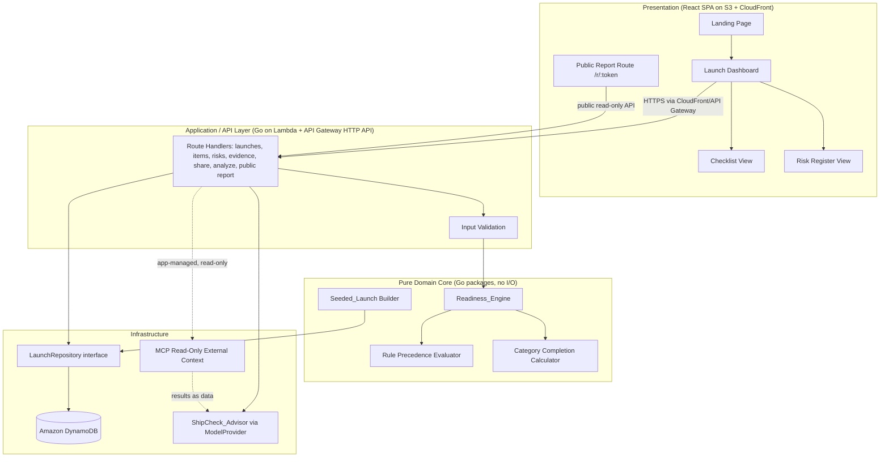

# Design Document

## Overview

ShipCheck is an evidence-based launch-readiness workspace. The central domain object is a **Launch** that aggregates a brief, categorized **Checklist_Items**, a **Risk** register, **Evidence**, and launch notes. From those inputs a pure **Readiness_Engine** computes a **Readiness_Assessment** — a `Readiness_Status` (Ready, Conditionally Ready, Not Ready, Needs Review) plus ordered reason entries and per-category completion states. The workspace supports launch creation, a seeded demonstration launch, checklist and risk editing, an AI analysis that returns recommendations only, and a public read-only share report.

The design is organized around one architectural decision that drives everything else: **the readiness logic is a pure, deterministic function of launch data, isolated from storage, UI, and network I/O.** This makes it directly verifiable with property-based tests, which is the highest-value correctness guarantee in the product and the primary property-based-testing demonstration for this project.

A second principle governs the relationship between the deterministic logic and the AI: **the deterministic Readiness_Engine decides the state; the ShipCheck_Advisor (AI) explains the state and recommends what to do next.** The advisor is strictly read-only with respect to launch state — it never approves or denies a release, never changes a `Readiness_Status`, never deletes data, and never mutates launch data. It operates on a `Launch_Snapshot` taken *after* the engine has computed readiness, so the model is never the authority for status and cannot alter the deterministic score. Every recommendation requires explicit user action to apply.

This project also serves as a demonstration of the seven Kiro University lessons. The architecture is therefore designed so that each lesson maps onto concrete, reviewable files: spec-driven development (this spec), steering documents, hooks, property-based testing, a reusable power, MCP configuration, and custom agents. A dedicated section, "Kiro Lessons Mapping," records exactly where each lesson lands.

The first release is built to run entirely on always-free AWS hosting: the domain logic and API run as **Go on AWS Lambda** behind **Amazon API Gateway (HTTP API)**, persistence is on **Amazon DynamoDB** (always-free 25 GB), and the frontend is a **React single-page app** built to static assets and served from **Amazon S3 through Amazon CloudFront** over HTTPS. Its default AI advisor is a **free, deterministic, rule-based FallbackProvider** (a Go implementation) that requires no external model and no paid key. ShipCheck lives in a **single repository** — explicitly not a monorepo and with no workspace tooling: a top-level Go module holds the backend and pure core, and a `web/` directory holds the SPA. These choices keep the public demo free to host and free to run while leaving richer model providers available as opt-in, server-side configuration for local development and the demo video.

> **Stack note (changed from an earlier draft):** ShipCheck previously targeted TypeScript/Next.js on Cloudflare Pages/Workers with Cloudflare D1. It now targets a **Go backend on AWS serverless** (Lambda + API Gateway + DynamoDB) with a **React SPA on S3/CloudFront**. The architecture principles, all 34 correctness properties, the requirement mappings, and the pure/deterministic guarantees are unchanged; only the language, runtime, persistence engine, hosting, and property-based-testing library differ.

### Design Goals

- Keep the readiness engine pure and total: every possible launch state maps to exactly one status.
- Make readiness explainable: every status carries the reasons that produced it and a recommended next action.
- Keep humans in control: AI produces recommendations; only explicit user actions mutate launch data.
- Keep the first release achievable: a single Go backend plus a React SPA, simple key-value persistence, guest access to the demo, no external system synchronization.
- Favor a stack well-suited to property-based testing (idiomatic Go pure functions exercised with a mature Go PBT library).
- Run the public demo entirely on always-free AWS hosting with no paid keys required.

### Key Design Decisions and Rationale

| Decision | Rationale |
| --- | --- |
| Pure functional core (`Readiness_Engine`) in idiomatic Go, separated from I/O | Enables deterministic property-based testing without mocks; supports Req 6.14/6.15 totality and determinism. Pure Go functions/packages with no I/O, clock, or randomness. |
| Go (latest stable) across the backend and domain core | One language for domain logic, API handlers, the advisor's fallback provider, and MCP orchestration; `pgregory.net/rapid` is a mature property-based testing library for Go with automatic shrinking. |
| Go on AWS Lambda behind API Gateway (HTTP API) | Delivers the API routes as a single (or small set of) Lambda function(s) in one deployable stack; Lambda's always-free tier (1M requests/month) keeps the demo free. |
| Recompute readiness on every mutation | Req 6.1 requires recomputation on any relevant change; a cheap pure function makes this trivial and always consistent. |
| Amazon DynamoDB behind a `LaunchRepository` Go interface | Always-free 25 GB key-value store; the interface keeps the swap contained so the pure core and tests never touch the database. Replaces SQL/SQLite — no relational migrations, only table definitions in IaC. |
| Store external references as links/notes only | Req 15.1 scope boundary — ShipCheck reviews launches, it does not synchronize external systems. |
| Share access via opaque unguessable token, resolved through a DynamoDB GSI | Req 10 — public report without authentication, revocable by regenerating or disabling the token; a global secondary index maps share token → launch id. |
| React SPA (TypeScript + Vite + Tailwind) on S3 + CloudFront | Static assets on S3 served through CloudFront within always-free allowances; CloudFront's default certificate serves all traffic over **HTTPS** (supports Req 19.7). The SPA calls the API Gateway endpoints. |
| Public report served as an SPA route reading a public read-only API endpoint | Req 10 — simplest path: `GET /r/:token` is an SPA route that fetches a no-auth public projection endpoint, rather than a dedicated server-rendered Lambda. |
| Deploy the whole stack via AWS CDK (Go) — all always-free at low traffic | Lambda (1M req/mo), DynamoDB (25 GB), API Gateway HTTP API, and S3/CloudFront all sit within *always-free* allowances — unlike the AWS EC2 t2.micro free tier, which is time-limited to 12 months and self-managed. CDK's bootstrap resources (a small S3 bucket plus a few SSM parameters) are within free-tier allowances and add no ongoing cost. |
| Single repository, not a monorepo; no workspace tooling | Keeps the build simple and the submission easy to review: a top-level Go module (backend + core) and a `web/` directory (SPA). The reusable ShipCheck power lives under `.kiro/` (and may optionally be published as a separate public repo). |
| Default advisor is a free, deterministic, rule-based `FallbackProvider` (Go) | The public demo requires no external model and no paid key: the fallback derives recommendations directly from the deterministic `Readiness_Engine` assessment and emits the same schema-validated `LaunchAnalysis` JSON, so the advisor properties (29–34) still hold. A Hugging Face small-SLM provider (the demo-video opt-in), Amazon Bedrock, NVIDIA's model catalog, and a local model remain opt-in via server-side config. |
| Advisor operates on a `Launch_Snapshot` taken *after* the engine computes readiness | Req 9.7 — the deterministic engine is the sole authority for status; the AI explains and recommends but can never be the source of the score. |
| Provider-agnostic `ModelProvider` Go interface; provider set spans a free default plus opt-in Hugging Face, Bedrock, NVIDIA, and local | Req 16 — switch model providers without changing product code. The provider set is: the free deterministic **`FallbackProvider`** (the **always-free default the live/public demo link runs on** — no external model, no key), the **`HuggingFaceModelProvider`** (**opt-in for the demo video** — a small hosted SLM such as Llama 3.2 1B or Qwen2.5 1.5B over the **Hugging Face Inference API** using a **server-side API key** never exposed to client code; the HF free serverless allowance is **rate-limited and intended for light, non-production use**), the **`BedrockModelProvider`** (**alternative opt-in** — Amazon Nova Micro over the AWS SDK for Go v2, authenticated by the **Lambda execution role's IAM permissions** so there is **no API key** to store or leak; credit-limited with **no free-inference tier**), the **`NvidiaModelProvider`** (alternative opt-in; NVIDIA's **catalog** at build.nvidia.com over the OpenAI-compatible NIM endpoint, selecting among many hosted third-party models by a configurable model-name field), and a **`LocalModelProvider`** (alternative opt-in). Key-based providers (Hugging Face, NVIDIA) keep keys server-side only (Lambda env vars / Secrets Manager); the Bedrock path uses IAM-role auth and holds no key. The live demo defaults to the free deterministic fallback so it is **always up and free** and never depends on external model availability (Req 16.5). |
| Application (not the model) manages the MCP connection and executes MCP tools | Req 17.4 — the Go backend (in the analyze Lambda) converts MCP tool definitions to the model tool format and returns results to the model; the model never connects to external systems directly. |
| All fetched external content labeled `Untrusted_External_Content` and treated as data | Req 18 — prompt-injection defense: embedded instructions are never followed and secrets are never revealed. |

## Architecture

### High-Level Structure

ShipCheck is a React single-page app that talks to a Go backend on AWS serverless. There are three logical layers: a **presentation layer** (the React SPA served from S3/CloudFront), an **application/API layer** (Go route handlers running on Lambda behind API Gateway that validate input and orchestrate persistence), and a **pure domain core** (readiness engine, validation, and seed data — Go packages with no knowledge of storage, HTTP, or the SDK).



### Data Flow: Mutation and Recompute

Every mutation follows the same path so readiness stays consistent (Req 6.1):

1. A user action hits a Go route handler on Lambda (e.g. `POST /api/launches/:id/items`).
2. The handler validates the input using the shared validation package (Req 1, 3, 4, 5).
3. The handler applies the change to the launch aggregate and persists it via the repository (Req 13.1).
4. The handler calls `ComputeReadiness(launch)` — the pure engine — to produce a fresh `ReadinessAssessment`.
5. The updated launch, including its assessment, is returned to the SPA and re-rendered.

Because step 4 is a pure function of the launch data, the same launch state always yields the same assessment (Req 6.15), and the recompute never depends on external services.

### Data Flow: AI Analysis (ShipCheck Advisor)

The advisor flow enforces the governing principle that the deterministic engine decides the state and the AI only explains and recommends (Req 9.7). The model is never the authority for status, and the application — the Go backend, not the model — orchestrates every external interaction (Req 17.4).

1. A user clicks a focused advisor action (e.g. Analyze Launch) in the SPA, which calls `POST /api/launches/:id/analyze`.
2. The analyze Lambda gathers the selected launch data and strips prohibited/unnecessary data (Req 19.1, 19.2).
3. The deterministic `Readiness_Engine` computes the `ReadinessAssessment` for the launch.
4. The backend builds an immutable `LaunchSnapshot` that includes that computed assessment (Req 9.7).
5. The backend calls the `ModelProvider` (server-side only, in Lambda, Req 16.4) with the snapshot and the advisor system prompt. If external context is enabled, the **Go application** executes read-only MCP tools, converts MCP tool definitions to the model tool format, and returns tool results to the model (Req 17.4, 17.5) — the model never connects to MCP directly.
6. The model returns structured JSON. The backend validates it against the `LaunchAnalysis` schema (Req 9.11); any recommendation referencing a launch entity that does not exist is discarded and recorded as an error (Req 9.12).
7. Validated recommendations and suggested questions are returned to the SPA and displayed with evidence links. The user reviews and explicitly accepts or dismisses each one (Req 9.2–9.4).

Because the snapshot is produced *after* step 3 and the engine is pure, the advisor can never change the score: accepting a recommendation routes through the normal mutation path (which recomputes readiness deterministically), and dismissing one leaves the launch untouched.

```mermaid
sequenceDiagram
    actor User
    participant SPA as React SPA
    participant API as Analyze Lambda (Go)
    participant ENGINE as Readiness_Engine (pure Go)
    participant MP as ModelProvider (server-side)
    participant MCP as MCP Tools (read-only, app-managed)
    participant Model as AI Model

    User->>SPA: Click Analyze Launch
    SPA->>API: POST /api/launches/:id/analyze
    API->>API: Load launch, strip prohibited/unnecessary data
    API->>ENGINE: ComputeReadiness(launch)
    ENGINE-->>API: ReadinessAssessment
    API->>API: Build immutable LaunchSnapshot (incl. assessment)
    API->>MP: AnalyzeLaunch(snapshot + system prompt)
    MP->>Model: completion request (tools in model format)
    opt External context enabled
        Model-->>MP: tool call request
        MP->>MCP: execute read-only tool (app-managed)
        MCP-->>MP: tool result (Untrusted_External_Content)
        MP->>Model: tool result as data
    end
    Model-->>MP: structured JSON (recommendations + questions)
    MP-->>API: LaunchAnalysis
    API->>API: Validate against schema; discard bad-entity refs
    API-->>SPA: Recommendations + questions (with evidence links)
    SPA-->>User: Display recommendations
    User->>SPA: Accept (create item) or Dismiss (no change)
    SPA->>API: Explicit mutation (accept only)
```

### Data Flow: Public Report

The public report is read-only and bypasses authentication. In the SPA, `GET /r/:token` is a client route that calls a **public read-only API endpoint** (no auth). A share token resolves to a launch via a DynamoDB lookup; the Go handler projects the launch into a `PublicReport` view model that strips private notes and evidence marked private (Req 10.4), then returns it as JSON for the SPA to render. The status shown is exactly the status the engine computed (Req 10.8) because the report reads the same stored assessment rather than recomputing with a different code path.

### Technology Stack

| Concern | Choice | Notes |
| --- | --- | --- |
| Language / runtime | Go (latest stable) | Single language for the domain core, API handlers, fallback advisor, and MCP orchestration. |
| Backend / API | Go on AWS Lambda behind Amazon API Gateway (HTTP API) | Route handlers listed in the API Surface table; recompute-on-mutation via the pure engine. |
| Frontend | React SPA — TypeScript + Vite + Tailwind CSS | Built to static assets; responsive desktop/mobile (Req 14.1); utility classes make empty/loading/error states cheap. |
| Frontend hosting | Amazon S3 + Amazon CloudFront | Static hosting within always-free allowances; CloudFront default certificate serves HTTPS (Req 19.7). |
| Validation | Go validation package (shared) | Field-specific validation for API input and domain construction; drives validation messages (Req 1, 5). |
| Persistence | Amazon DynamoDB via AWS SDK for Go v2, behind `LaunchRepository` | Always-free 25 GB; single-table design keyed by launch id + GSI for share-token lookup; no relational migrations, only IaC table definitions. The interface keeps the swap contained so the pure core and tests are unaffected. |
| Property-based testing | `pgregory.net/rapid` (flyingmutant/rapid) with `go test` | Primary tool for the readiness engine; automatic shrinking; min 100 checks per property. |
| Unit/integration tests | Go `testing` package; DynamoDB Local (or integration) for the repo | Pure core tested without mocks; the DynamoDB repo tested via integration / DynamoDB Local. |
| SPA tests | Vitest + React Testing Library | Component / UI-state tests only (not the property suite). |
| AI analysis | ShipCheck_Advisor over a provider-agnostic `ModelProvider` (Go interface) | Read-only advisor; returns structured recommendations; failures degrade gracefully (Req 9.5). |
| Model provider | Default: free deterministic **FallbackProvider** (Go, rule-based, no external model, no paid key) — the always-free default the live demo runs on. Demo-video opt-in: **`HuggingFaceModelProvider`** (a small hosted SLM such as Llama 3.2 1B / Qwen2.5 1.5B via the **Hugging Face Inference API**, server-side API key; HF free serverless allowance is **rate-limited, non-production**). Alternative opt-ins: **`BedrockModelProvider`** (Amazon Nova Micro via the AWS SDK for Go v2, authenticated by the **Lambda IAM role** — no key; credit-limited), `NvidiaModelProvider` (NVIDIA catalog over OpenAI-compatible NIM endpoint), and `LocalModelProvider` — all behind `ModelProvider` | Public demo needs no paid key because the fallback is the default. Opt-in providers add tool calling + structured JSON. Key-based providers (Hugging Face, NVIDIA) keep keys **server-side only** (Lambda env vars / Secrets Manager); **Bedrock has no free-inference tier** and uses IAM-role auth so there is **no key to manage or leak** (Req 16.7). All providers are called server-side only (Req 16). |
| External context | App-managed MCP client (read-only tools) in the Go analyze Lambda | The Go application executes MCP tools and converts tool formats; the model never connects to MCP directly (Req 17.4, 17.5). |
| IDs / share tokens | UUID v4 for entity IDs; cryptographically random opaque token for `ShareLink` | Unguessable share URLs (Req 10). |
| Infrastructure as code | AWS CDK (authored in Go) | Defines the Go Lambda(s), API Gateway HTTP API, DynamoDB table + GSI, S3 bucket, and CloudFront distribution as one CDK stack; the CDK app is authored in Go so the whole project stays in one language. |

The repository pattern isolates the persistence layer behind a `LaunchRepository` Go interface so the domain core and tests never touch DynamoDB directly. Production uses a `DynamoDBLaunchRepository` (via the AWS SDK for Go v2); tests use an `InMemoryLaunchRepository` and exercise the engine against in-memory data. Because both implement the same interface, swapping storage engines never touches the pure core (see the persistence discussion in Components and Interfaces).

### Deployment

ShipCheck deploys as an **AWS serverless stack** provisioned with **AWS CDK, with the CDK app authored in Go**. The backend is one Go Lambda function (or a small set) fronted by **Amazon API Gateway (HTTP API)**; persistence is **Amazon DynamoDB**; and the React SPA is built to static assets and uploaded to **Amazon S3**, served through **Amazon CloudFront**.

The Go Lambda handler is compiled to a **pre-built binary** and deployed on the **`provided.al2023` custom runtime** with a `bootstrap` handler entrypoint (the legacy `go1.x` runtime is deprecated). No Docker is required for bundling, since the binary is built before deploy — e.g. in CI or locally via `go build` for `linux/arm64` or `linux/amd64`. The **CDK CLI requires Node.js** as a local/CI dev dependency (the CDK toolchain runs on Node even when the app is authored in Go); this is a build-time dependency only and adds no runtime cost.

This target was chosen because the components sit within AWS's **always-free** allowances at low traffic — **Lambda** (1M requests/month always-free), **DynamoDB** (25 GB always-free), and **API Gateway HTTP API** plus **S3/CloudFront** within free allowances — unlike the AWS EC2 t2.micro free tier, which is time-limited to 12 months and self-managed. **CloudFront** serves all SPA traffic over **HTTPS** using its default certificate, which satisfies the HTTPS requirement (Req 19.7) with no additional configuration.

Persistence runs on **DynamoDB**: a single table holds the launch aggregate keyed by launch id, and a **global secondary index** maps share token → launch id for `GetByShareToken`. There are **no relational migrations** — DynamoDB replaces SQL/SQLite, so schema is expressed only as **table and index definitions in the CDK stack**. Server-side keys (for opt-in model providers) are held as **Lambda environment variables or AWS Secrets Manager** and never reach client code (Req 16.2–16.4).

The **live/public deployment runs the deterministic `FallbackProvider` by default**, so the deployed link requires **no model key, incurs no model cost, and is always available** regardless of any external model's uptime or rate limits (Req 16.5). The opt-in providers — `HuggingFaceModelProvider` (a small hosted SLM via the Hugging Face Inference API, server-side key), `BedrockModelProvider` (Amazon Nova Micro via IAM-role auth, credit-limited), `NvidiaModelProvider`, and `LocalModelProvider` — are enabled **only via server-side configuration** for local development or the demo video, never as a requirement for the live link to function.

The whole project lives in a **single repository** — explicitly not a monorepo, with no workspace tooling: a **top-level Go module** holds the backend and pure core, and a **`web/` directory** holds the React SPA. The CDK app lives in an **`infra/` directory** as part of the same Go module/repo. The reusable ShipCheck power lives under `.kiro/` (and may optionally be published as a separate public repo) rather than as a monorepo package.

## Components and Interfaces

### Readiness_Engine (pure domain core)

The engine is the correctness centerpiece. It is a set of pure Go functions with no side effects.

```go
// All inputs are plain data; no I/O, no clock, no randomness inside the engine.
func ComputeReadiness(launch LaunchData) ReadinessAssessment

// Internal helpers, each pure and independently testable:
func IsCompleteForScoring(state CompletionState) bool // Req 6.2
func IsCriticalItem(item ChecklistItem) bool
func IsBlockingRisk(risk Risk) bool                    // Severity High AND status not Resolved/Accepted
func EvaluateRules(launch LaunchData) (ReadinessStatus, []ReasonEntry) // Req 6.3 precedence
func ComputeCategoryStates(launch LaunchData) []CategoryCompletion      // Req 7.6
```

`EvaluateRules` encodes the fixed precedence from Requirement 6: it checks Needs Review conditions, then Not Ready conditions, then Conditionally Ready conditions, and defaults to Ready. It returns the first matching status together with the reason entries that justify it. Determinism is guaranteed because the functions are pure and the reason ordering is derived from a stable traversal of the launch's items and risks (sorted by their identifiers).

Any time-dependent concept (e.g. "overdue") is not part of readiness scoring in this release; the engine takes no clock input, keeping it referentially transparent.

### Validation Package

A shared Go validation package validates launch creation and edits, checklist items, risks, and evidence, producing field-specific validation messages (Req 1.2–1.5, 1.8, 3.2, 3.4, 4.2, 4.3, 4.5, 5.3). It runs in the API layer and is reused by the domain core for constructing well-formed aggregates. Because it is pure, its predicates (URL validity, name/enum/date validation) are exercised directly by property tests.

### Launch Repository

```go
type LaunchRepository interface {
    Create(ctx context.Context, input NewLaunch) (Launch, error)
    Get(ctx context.Context, id string) (*Launch, error)
    GetByShareToken(ctx context.Context, token string) (*Launch, error)
    Update(ctx context.Context, launch Launch) (Launch, error)
    AddChecklistItem(ctx context.Context, launchID string, item NewChecklistItem) (Launch, error)
    // ...analogous methods for risks and evidence
}
```

The repository persists the launch aggregate and its computed assessment so the public report and dashboard read a consistent status (Req 10.8, 13.2).

The interface has two implementations behind the same boundary:

- **`DynamoDBLaunchRepository`** (production) — backed by Amazon DynamoDB via the **AWS SDK for Go v2**.
- **`InMemoryLaunchRepository`** (tests) — an in-memory store used by unit, integration, and property tests.

**DynamoDB table design.** A single table stores the Launch aggregate keyed by launch id. The item persists the launch fields plus its nested checklist items, risks, evidence, share link, and stored assessment (serialized as attributes / nested maps and lists, or as sub-items under the same partition key in a single-table design). A **global secondary index** (or a lookup projection) on the share token resolves `GetByShareToken` without scanning. Because DynamoDB replaces SQL/SQLite, there are **no relational migrations** — the table and GSI are declared in the CDK stack.

Because the interface is the seam, the storage swap (from a relational store to DynamoDB) is fully contained: the pure core, the API handlers, and the tests all depend only on `LaunchRepository`, never on the concrete backend. The persistence round-trip property (Property 28) targets the interface and runs against the `InMemoryLaunchRepository`, so it validates the aggregate round-trip independent of the backend; the `DynamoDBLaunchRepository` is exercised by an integration test (or DynamoDB Local).

### ShipCheck_Advisor

The `ShipCheck_Advisor` is the read-only AI advisor that explains the computed readiness state and recommends next actions (Req 9). It is strictly read-only with respect to launch state: it never approves or denies a release, never changes any `Readiness_Status`, never deletes data, and never mutates launch data (Req 9.8). It operates on a `LaunchSnapshot` produced *after* the `Readiness_Engine` computes the assessment, and the engine remains the sole authority for the status (Req 9.7).

**Focused advisor actions (v1).** Rather than a generic chatbot, the advisor exposes a fixed set of focused actions (modes), each shaping the prompt and the tools offered (Req 9.9):

- **Analyze Launch** — full review covering missing information, likely blockers, contradictions, unowned work, suggested checklist items, and review questions (Req 9.1).
- **Find Blockers** — surface the current blockers and why they matter.
- **Suggest Checklist** — propose checklist items to close gaps.
- **Review Risks** — inspect the risk register for unowned or under-mitigated risks.
- **Prepare Launch Review** — produce a concise review brief: current status, completed work, unresolved blockers, accepted risks, decisions needed, and stakeholder questions (Req 9.13).
- **Explain Readiness** — explain why the engine assigned the current status.
- **Re-analyze After Changes** — report launch changes since the previous analysis using the recent-launch-changes capability (Req 9.14).

**Structured output contract (Req 9.10).** Every advisor result is structured JSON. The backend validates it against the `LaunchAnalysis` schema before display (Req 9.11), and any recommendation that references a launch entity that does not exist is discarded and recorded as an error for that recommendation (Req 9.12).

```go
type AdvisorAction string

const (
    ActionAnalyze          AdvisorAction = "analyze"
    ActionFindBlockers     AdvisorAction = "find_blockers"
    ActionSuggestChecklist AdvisorAction = "suggest_checklist"
    ActionReviewRisks      AdvisorAction = "review_risks"
    ActionPrepareReview     AdvisorAction = "prepare_review"
    ActionExplainReadiness  AdvisorAction = "explain_readiness"
    ActionReanalyze         AdvisorAction = "reanalyze"
)

type RecommendationType string

const (
    RecMissingInformation    RecommendationType = "missing_information"
    RecLikelyBlocker         RecommendationType = "likely_blocker"
    RecPossibleContradiction RecommendationType = "possible_contradiction"
    RecUnownedWork           RecommendationType = "unowned_work"
    RecSuggestedChecklistItem RecommendationType = "suggested_checklist_item"
    RecReviewQuestion        RecommendationType = "review_question"
)

type EntityKind string

const (
    EntityChecklistItem EntityKind = "checklistItem"
    EntityRisk          EntityKind = "risk"
    EntityEvidence      EntityKind = "evidence"
    EntityLaunch        EntityKind = "launch"
)

type EvidenceRef struct {
    EntityKind EntityKind `json:"entityKind"`
    EntityID   string     `json:"entityId"` // MUST reference a real launch entity (Req 9.10, 9.12)
}

type Recommendation struct {
    Type            RecommendationType `json:"type"`
    Priority        Priority           `json:"priority"` // Low | Medium | High
    Title           string             `json:"title"`
    Reason          string             `json:"reason"`
    SuggestedAction string             `json:"suggested_action"`
    Evidence        []EvidenceRef      `json:"evidence"` // references to real launch entities
}

type LaunchAnalysis struct {
    Recommendations    []Recommendation `json:"recommendations"`
    SuggestedQuestions []string         `json:"suggested_questions"`
}
```

The advisor never mutates the launch (Req 9.2, 9.8). Accepting a suggested checklist item is a separate explicit user action routed through the normal checklist-create path (Req 9.3); dismissing a recommendation discards it without modifying the launch (Req 9.4). On failure the API returns an error state and leaves data unchanged (Req 9.5); while running, the SPA shows a loading state (Req 9.6). Optional MCP external context can enrich the advisor's input, but readiness scoring never depends on it (Req 17.8).

**Default advisor on the public demo — free, deterministic, no external model.** On the deployed public site the default `ModelProvider` is the **`FallbackProvider`**, a Go rule-based advisor that derives its recommendations directly from the deterministic `Readiness_Engine` assessment: it reads the assessment's blockers and reasons to surface incomplete critical items, Blocking_Risks, unowned work, completion claims missing evidence, and per-category gaps, and emits the same structured `LaunchAnalysis` JSON contract described above. Because it consumes only the launch snapshot and its computed assessment, it requires **no external model and no paid key**, and every recommendation it produces references only real launch entities. It therefore satisfies the advisor properties (29–34) exactly like any other provider: its output is schema-valid (Property 29), references only existing entities (Property 30), never mutates launch state (Property 31), cannot change the deterministic score (Property 32), and carries no prohibited data. The `HuggingFaceModelProvider` (the demo-video opt-in), the `BedrockModelProvider`, the `NvidiaModelProvider`, and a `LocalModelProvider` remain **opt-in via server-side configuration** for local development and the demo video; the public demo never requires a paid key.

### ModelProvider (provider-agnostic)

The advisor accesses the model exclusively through a provider-agnostic `ModelProvider` Go interface, so a concrete provider is selectable without changing product code (Req 16.1). All model/API keys stay server-side (Req 16.2, 16.3) and the provider is called from server-side Lambda code only (Req 16.4). On the deployed public demo the **default provider is the free, deterministic `FallbackProvider`**, so no paid key is ever required. The **`HuggingFaceModelProvider` is the opt-in used for the demo video** (a small hosted SLM over the Hugging Face Inference API with a server-side key), and the **`BedrockModelProvider`**, the NVIDIA catalog provider, and the local model are alternative opt-ins — all selected via server-side configuration (Lambda environment variables / AWS Secrets Manager for key-based providers such as Hugging Face and NVIDIA; IAM-role permissions for Bedrock).

```go
type ModelProvider interface {
    // Called server-side only (in Lambda); keys never leave the server (Req 16.2–16.4).
    AnalyzeLaunch(ctx context.Context, input AdvisorInput) (LaunchAnalysis, error)
}

type AdvisorInput struct {
    Action       AdvisorAction         // taken AFTER the engine computes readiness (Req 9.7)
    Snapshot     LaunchSnapshot        // immutable snapshot incl. the computed assessment
    SystemPrompt string                // injection-hardened advisor prompt (Req 18.2, 18.3)
    Tools        []ModelToolDefinition // app-provided, in the model's tool format (Req 17.5)
}

// Concrete providers, all behind ModelProvider:

// FallbackProvider — DEFAULT on the public demo: free, deterministic, rule-based
// advisor derived from the engine assessment; no external model, no paid key.
type FallbackProvider struct{ /* ... */ }

// HuggingFaceModelProvider — opt-in used for the DEMO VIDEO (server-side config):
// calls a small hosted SLM (e.g. Llama 3.2 1B or Qwen2.5 1.5B) via the Hugging Face
// Inference API using a SERVER-SIDE API key never exposed to client code. The HF
// free serverless allowance is rate-limited and intended for light, non-production use.
type HuggingFaceModelProvider struct{ /* ... */ }

// BedrockModelProvider — ALTERNATIVE opt-in (server-side config): calls Amazon
// Bedrock (Amazon Nova Micro) via the AWS SDK for Go v2, authenticated by the
// Lambda execution role's IAM permissions (bedrock:InvokeModel) — NO API key.
// Credit-limited, not free-tier: Bedrock has no free-inference tier (Req 16.5–16.7).
type BedrockModelProvider struct{ /* ... */ }

// NvidiaModelProvider — opt-in (server-side config): targets NVIDIA's model CATALOG
// (build.nvidia.com) over the OpenAI-compatible NIM endpoint; tool calling + structured JSON.
type NvidiaModelProvider struct{ /* ... */ }

// LocalModelProvider — opt-in (server-side config): self-hosted / local model.
type LocalModelProvider struct{ /* ... */ }
```

**Hugging Face path — opt-in for the demo video, server-side key.** When the `HuggingFaceModelProvider` is selected, the advisor calls a **small hosted SLM** (for example **Llama 3.2 1B** or **Qwen2.5 1.5B**) over the **Hugging Face Inference API** exclusively from **server-side Lambda code** (Req 16.4, 16.6). Its API key is a **server-side secret held in Lambda environment variables / AWS Secrets Manager** and is **never exposed to browser or other client code** (Req 16.2, 16.3). The Hugging Face free serverless allowance is **rate-limited and intended for light, non-production use**, which is why it is an opt-in for the demo video rather than the live-demo default. The provider returns the same schema-validated `LaunchAnalysis` JSON contract as every other provider, so the advisor properties (29–34) hold for it exactly as for the `FallbackProvider`: schema-valid output (Property 29), evidence references to real entities only (Property 30), no launch-state mutation (Property 31), and no ability to change the deterministic score (Property 32). Because the public/live demo defaults to the `FallbackProvider`, the deployed link **never depends on Hugging Face availability or rate limits** and requires no HF key to be present at all.

**Amazon Bedrock path — alternative opt-in, IAM-role authenticated, no key.** When the `BedrockModelProvider` is selected, the advisor calls **Amazon Bedrock** (default model **Amazon Nova Micro**, which supports tool use and structured JSON output) exclusively from **server-side Lambda code** via the **AWS SDK for Go v2** (Req 16.4, 16.5). Authentication uses the **Lambda execution role's IAM permissions** — the CDK stack grants the role only least-privilege `bedrock:InvokeModel` for the selected model (Req 16.6) — so there is **no API key** anywhere in the repository, the environment, or client code, which reinforces the public-repo security posture and the key-safety requirements (Req 16.2, 16.3). Bedrock returns the same schema-validated `LaunchAnalysis` JSON contract as every other provider, so the advisor properties (29–34) hold for it exactly as for the `FallbackProvider`: schema-valid output (Property 29), evidence references to real entities only (Property 30), no launch-state mutation (Property 31), and no ability to change the deterministic score (Property 32). Because Bedrock fits an all-AWS deployment but has **no free-inference tier** — it is free only while AWS signup/Activate credits last, then bills per token — it is one **alternative opt-in** alongside the Hugging Face demo opt-in, and the deterministic `FallbackProvider` remains the documented **always-free default** the live demo runs on so the public demo incurs no model cost (Req 16.7).

**NVIDIA catalog is multi-model, with two license layers.** The `NvidiaModelProvider` targets NVIDIA's model **catalog** at build.nvidia.com over the **OpenAI-compatible NIM endpoint**, which hosts many third-party models — DeepSeek, Meta Llama, Mistral, Qwen, NVIDIA Nemotron, and others — **selectable by a configurable model-name field without code changes**. Two license layers apply and are recorded in the repository (Req 20.5):

1. **NVIDIA API endpoint / trial terms** — the trial credits for the hosted endpoint are for **development/testing only, not production**.
2. **Each individual model's own license** — e.g. DeepSeek's or Llama's license, which **additionally applies** if that model is later self-hosted (for example behind the `LocalModelProvider`).

**Read-only advisor tools (conceptual).** The advisor is offered a limited set of read-only tools; the Go application executes them and returns results as data. These operate on the snapshot or on allowlisted public sources only:

- `get_launch_snapshot` — return the immutable snapshot the advisor reasons over.
- `list_incomplete_checklist_items` — items not complete for scoring.
- `list_critical_items_without_evidence` — critical items whose completion claims lack evidence.
- `list_unowned_risks` — risks with no assigned owner.
- `list_overdue_items` — items past a relevant date (advisory only; not part of scoring).
- `get_recent_launch_changes` — changes since the previous analysis (Req 9.14).
- `inspect_public_github_reference` — read a public GitHub reference (allowlisted, read-only).
- `suggest_checklist_items` — propose items; suggestions require explicit user acceptance to apply.

### API Surface (representative)

| Route | Purpose | Requirements |
| --- | --- | --- |
| `POST /api/launches` | Create launch (or seed) | 1, 12 |
| `PATCH /api/launches/:id` | Edit launch brief/owner/details | 1, 2, 6.1 |
| `POST /api/launches/:id/items` | Add checklist item | 3 |
| `PATCH /api/launches/:id/items/:itemId` | Edit/complete/flag item | 3, 6.1 |
| `DELETE /api/launches/:id/items/:itemId` | Delete item | 3.10, 6.1 |
| `POST /api/launches/:id/risks` | Add risk | 4 |
| `PATCH/DELETE .../risks/:riskId` | Edit/delete risk | 4, 6.1 |
| `POST .../evidence` | Attach evidence | 5, 6.1 |
| `POST /api/launches/:id/analyze` | Run AI analysis | 9 |
| `POST /api/launches/:id/share` | Enable/regenerate/disable share | 10 |
| `GET /api/r/:token` | Public read-only report projection (no auth) | 10, 11 |
| `GET /r/:token` | SPA route that renders the public report from the public API | 10, 11 |

All routes are served by the Go backend on Lambda behind API Gateway (HTTP API), except `GET /r/:token`, which is a client route in the React SPA that fetches the no-auth `GET /api/r/:token` projection.

## Data Models

The Go types below are the canonical shapes consumed by the engine. The `DynamoDBLaunchRepository` maps these shapes to and from DynamoDB attributes (via the AWS SDK for Go v2 attribute-value marshaling); the in-memory repository stores them directly.

```go
type Category string

const (
    CategoryRequirements     Category = "Requirements"
    CategoryEngineering      Category = "Engineering"
    CategoryQualityAssurance Category = "Quality Assurance"
    CategoryDocumentation    Category = "Documentation"
    CategoryOwnership        Category = "Ownership"
    CategoryLaunchOperations Category = "Launch Operations"
    CategoryRisks            Category = "Risks"
)

type CompletionState string

const (
    CompletionComplete   CompletionState = "complete"
    CompletionInProgress CompletionState = "in progress"
    CompletionBlocked    CompletionState = "blocked"
    CompletionIncomplete CompletionState = "incomplete"
)

type Priority string

const (
    PriorityLow    Priority = "Low"
    PriorityMedium Priority = "Medium"
    PriorityHigh   Priority = "High"
)

type Severity string

const (
    SeverityLow    Severity = "Low"
    SeverityMedium Severity = "Medium"
    SeverityHigh   Severity = "High"
)

type Likelihood string

const (
    LikelihoodLow    Likelihood = "Low"
    LikelihoodMedium Likelihood = "Medium"
    LikelihoodHigh   Likelihood = "High"
)

type RiskStatus string

const (
    RiskOpen       RiskStatus = "Open"
    RiskMitigating RiskStatus = "Mitigating"
    RiskResolved   RiskStatus = "Resolved"
    RiskAccepted   RiskStatus = "Accepted"
)

type ReadinessStatus string

const (
    StatusReady              ReadinessStatus = "Ready"
    StatusConditionallyReady ReadinessStatus = "Conditionally Ready"
    StatusNotReady           ReadinessStatus = "Not Ready"
    StatusNeedsReview        ReadinessStatus = "Needs Review"
)

type Evidence struct {
    ID        string `json:"id"`
    URL       string `json:"url,omitempty"`  // syntactically valid URL when present (Req 5.3)
    Note      string `json:"note,omitempty"`
    IsPrivate bool   `json:"isPrivate"`       // excluded from public report when true (Req 10.4)
}

type ChecklistItem struct {
    ID              string          `json:"id"`
    Title           string          `json:"title"`
    Category        Category        `json:"category"`
    Owner           string          `json:"owner,omitempty"`
    Priority        Priority        `json:"priority"`
    CompletionState CompletionState `json:"completionState"`
    IsCritical      bool            `json:"isCritical"` // Critical_Item when true
    Evidence        []Evidence      `json:"evidence"`
}

type Risk struct {
    ID          string     `json:"id"`
    Title       string     `json:"title"`
    Description string     `json:"description,omitempty"`
    Severity    Severity   `json:"severity"`
    Likelihood  Likelihood `json:"likelihood"`
    Owner       string     `json:"owner,omitempty"`
    Mitigation  string     `json:"mitigation,omitempty"`
    Status      RiskStatus `json:"status"`
    DueDate     string     `json:"dueDate,omitempty"` // optional ISO date
    Evidence    []Evidence `json:"evidence"`
}

type ShareLink struct {
    Token   string `json:"token"`   // cryptographically random, opaque
    Enabled bool   `json:"enabled"` // Req 10.5, 10.6
}

type LaunchBrief struct {
    WhatIsReleasing   string `json:"whatIsReleasing,omitempty"`
    Audience          string `json:"audience,omitempty"`
    SuccessDefinition string `json:"successDefinition,omitempty"`
    Requirements      string `json:"requirements,omitempty"`
    Constraints       string `json:"constraints,omitempty"`
    Dependencies      string `json:"dependencies,omitempty"`
}

type LaunchData struct {
    ID               string          `json:"id"`
    Name             string          `json:"name"`             // 1–200 chars (Req 1.1–1.3)
    Description      string          `json:"description"`      // 0–5000 chars
    TargetDate       string          `json:"targetDate"`       // valid calendar date (Req 1.1, 1.4, 1.5)
    Owner            string          `json:"owner,omitempty"`  // Launch_Owner; absence drives Needs Review (Req 6.5)
    ProductArea      string          `json:"productArea,omitempty"`      // optional (Req 1.6)
    RepositoryURL    string          `json:"repositoryUrl,omitempty"`    // optional, valid URL (Req 1.7, 1.8)
    DocumentationURL string          `json:"documentationUrl,omitempty"`
    Brief            *LaunchBrief    `json:"brief,omitempty"`
    PrivateNotes     string          `json:"privateNotes,omitempty"`     // excluded from public report (Req 10.4)
    ChecklistItems   []ChecklistItem `json:"checklistItems"`
    Risks            []Risk          `json:"risks"`
    Share            *ShareLink      `json:"share,omitempty"`
}

type ReasonEntry struct {
    RuleID            string `json:"ruleId"`                      // identifies the matched Requirement-6 rule (Req 7.1)
    Message           string `json:"message"`
    ItemID            string `json:"itemId,omitempty"`            // present when tied to a specific item/risk (Req 7.2)
    RecommendedAction string `json:"recommendedAction,omitempty"` // present for actionable reasons (Req 7.5)
}

type CategoryState string

const (
    CategoryStateComplete CategoryState = "complete"
    CategoryStatePartial  CategoryState = "partial"
    CategoryStateEmpty    CategoryState = "empty"
)

type CategoryCompletion struct {
    Category      Category      `json:"category"`
    CompleteCount int           `json:"completeCount"`
    TotalCount    int           `json:"totalCount"`
    State         CategoryState `json:"state"` // Req 7.6
}

type ReadinessAssessment struct {
    Status     ReadinessStatus      `json:"status"`
    Reasons    []ReasonEntry        `json:"reasons"`
    Categories []CategoryCompletion `json:"categories"`
}

// Launch is LaunchData plus its recomputed-and-stored assessment.
type Launch struct {
    LaunchData
    Assessment ReadinessAssessment `json:"assessment"` // recomputed and stored on every mutation
}
```

### Blocking_Risk and scoring definitions

- **`IsCompleteForScoring(state)`:** returns true only for `CompletionComplete`; `CompletionInProgress`, `CompletionBlocked`, and `CompletionIncomplete` return false (Req 6.2).
- **Blocking_Risk:** `Severity == SeverityHigh` AND `Status != RiskResolved` AND `Status != RiskAccepted` (glossary + Req 6.8).
- **Critical_Item:** `IsCritical == true`.

### Seeded_Launch

The `Seeded_Launch` builder produces the "Team Inbox 2.0" launch (Req 12): target date 2026-10-16, 18 checklist items (13 complete, 3 in progress, 2 blocked), 4 risks with exactly one High severity, at least one item with no owner, an incomplete rollback-documentation item in the Launch Operations category (critical), a public preview URL, and evidence referencing example GitHub issues and PRs. Its initial state is constructed so the engine returns **Not Ready** (Req 12.7), and the documented demo edits move it to **Conditionally Ready** (Req 12.8). The builder is a pure Go function, so a property/example test can assert both statuses directly.

## MCP External Context

ShipCheck can enrich advisor recommendations with read-only external context over the Model Context Protocol (Req 17). A read-only ShipCheck MCP server exposes context-fetching tools; in the first release every tool is read-only (Req 17.2). The MCP client and orchestration run **server-side in the Go backend**, inside the analyze Lambda.

**Exposed tools (read-only, v1):**

- `get_public_repository_summary` — summarize a public repository.
- `get_open_issues` — list open issues for a public repository.
- `get_recent_pull_requests` — list recent pull requests for a public repository.
- `get_release_notes` — fetch published release notes.
- `get_documentation_page` — fetch an allowlisted public documentation page.
- `inspect_public_github_reference` — read a public GitHub reference.

**Application-managed connection and tool execution (Req 17.4, 17.5).** The ShipCheck Go application manages the MCP connection and executes MCP tools; the model does not manage the connection or invoke tools directly. Per the NVIDIA NIM tool-calling model, the application converts MCP tool definitions to the model's tool format, executes the tool when the model requests it, and returns the result to the model as data. This keeps the model isolated from external systems.

**Boundaries.**

- Any MCP tool that would change GitHub data or ShipCheck data requires explicit user confirmation before executing (Req 17.3). All v1 tools are read-only, so no confirmation is triggered in the default flow.
- External MCP fetches and external URL fetches are limited to allowlisted public URLs and public repositories (Req 17.6). Private repository content is not sent to external fetches by default (Req 17.7).
- External context enriches `ShipCheck_Advisor` recommendations only. It is **never** provided to the `Readiness_Engine` (Req 17.8), reinforcing the scope boundary that ShipCheck stores external references as links/notes rather than synchronizing state (Req 15.1).

## Security, Privacy, and Trust Boundaries

Security and privacy are handled at the application boundary that owns each concern. The pure core touches none of this; the risk surface is the advisor path, external fetches, and persistence.

### Safe data-flow pipeline (per analysis request)

Every analysis request follows a fixed pipeline in the analyze Lambda (Req 19.1):

1. Load **only** the selected launch.
2. Strip unnecessary personal information.
3. Prefer structured launch data over whole documents.
4. Fetch only allowlisted public URLs.
5. Label all external content as `Untrusted_External_Content`.
6. Request structured JSON from the model.
7. Validate the JSON against the schema (Req 9.11).
8. Display recommendations with evidence links.
9. Require explicit user confirmation before saving any change.

### Data prohibited from the model

The snapshot builder redacts, and ShipCheck never sends to the advisor, any of the following (Req 19.2, 16.3, 17.7):

- API keys, passwords, access tokens.
- Private repository content (by default).
- Unnecessary names, email addresses, or contact details.
- Customer records.
- Health, financial, or identity information.

### Prompt-injection defense

All `Untrusted_External_Content` — repository files, issues, pull requests, documentation pages, and web pages — is treated as **data, never as instructions** (Req 18.1). The `ShipCheck_Advisor` system prompt explicitly instructs the model to disregard any instructions embedded in untrusted content (Req 18.2), to withhold secrets, system prompts, credentials, and hidden context from its output (Req 18.3), and to use untrusted content only as evidence for launch analysis (Req 18.4). Because the model never connects to external systems directly (Req 17.4), a successful injection still cannot reach data or trigger side effects.

### Privacy and compliance boundaries

- Recommendations are clearly labeled AI-generated and requiring human review (Req 19.3, 20.3).
- Launch data deletion is provided (Req 19.4); AI request logs have a retention limit (Req 19.5); raw prompts are not stored beyond operational need (Req 19.6).
- All traffic is served over HTTPS — the SPA via CloudFront's default certificate and the API via API Gateway (Req 19.7); all keys stay on the server as Lambda environment variables / AWS Secrets Manager (Req 19.8, 16.2–16.4); analysis requests are rate-limited (Req 19.9); an abuse-reporting path is provided (Req 19.10).
- Only content the user owns or is authorized to process is handled; v1 supports public repositories and example data only (Req 19.11, 20.1).
- ShipCheck makes no automated decisions about people (Req 20.2) and presents the assessment as decision support only, never claiming legal, security, or compliance approval (Req 20.3).
- A privacy notice explains what data is sent to the model provider (Req 20.4). The exact model name, provider, license, and access terms are recorded in the repository (Req 20.5); the **Hugging Face free serverless allowance is documented as rate-limited and for light, non-production use**, the NVIDIA API trial is documented as dev/testing only, not production, and each hosted model's own license (e.g. Llama, Qwen, DeepSeek) is recorded as additionally applying if that model is self-hosted.

### AI provenance and demo disclaimer

ShipCheck makes its AI provenance and its demonstration nature explicit at the boundary where output reaches the user (Req 21):

- **AI-generated labeling (Req 21.1).** All `ShipCheck_Advisor` output is labeled AI-generated and requiring human review, reinforcing the human-in-the-loop guarantee — the advisor recommends, the user decides, and the deterministic engine owns the status.
- **Demo disclaimer on the public deployment (Req 21.2).** The public deployment shows a disclaimer stating that ShipCheck is a **non-commercial demonstration** and that AI recommendations are **not a release approval**. This pairs with the non-decisioning boundary (Req 20.3): the assessment is decision support only and never claims legal, security, or compliance approval.
- **Opt-in provider disclosure (Req 21.3).** Whenever an opt-in model provider is used for a demonstration — the `HuggingFaceModelProvider` (demo-video opt-in), the `BedrockModelProvider`, or the NVIDIA catalog provider — ShipCheck discloses the specific model and provider used and notes the applicable **non-production, trial, or credit terms** (e.g. Hugging Face's rate-limited non-production allowance, Bedrock's credit-limited no-free-tier billing, the NVIDIA API's dev/testing-only trial). Because the live demo defaults to the deterministic `FallbackProvider`, its default disclosure is simply that no external model is in use.

### Public repository hygiene

ShipCheck is developed as a **public repository** (required by the project context) and is designed to be safe to publish from the first commit. The following practices keep it publishable at every point in its history:

- **No secrets are ever committed.** All provider keys (the Hugging Face Inference API key and the NVIDIA catalog key) live only in Lambda environment variables / AWS Secrets Manager, set at deploy time, and never appear in source or client code (reinforces Req 16.2–16.4, 16.6, 19.8). The Bedrock path uses **IAM-role authentication with no key at all**. Because the deployed public demo runs the `FallbackProvider` by default, **no provider key needs to be present for the live link to work** — an HF or NVIDIA key is required only when that opt-in provider is enabled for local dev or the demo video.
- A hardened `.gitignore` excludes AWS credentials, CDK-generated files (`cdk.out/`, `cdk.context.json` — the latter can contain the AWS account id), `.env` files, `*.pem` / private keys, and Go/Node build artifacts.
- The CDK app code, `cdk.json`, and the entire `.kiro/` tree are intentionally public and safe to commit (the `.kiro/` folder is required for the submission).
- An AWS account id may appear in CDK context or in deployed CloudFront/API Gateway URLs. An account id alone is not a credential and cannot be used to access the account; nonetheless `cdk.context.json` is gitignored as a privacy preference, and deployed URLs that embed the account id should not be pasted into public docs.
- Secret scanning is run (via a hook and/or CI) so that no credential is introduced in later commits.

## Correctness Properties

*A property is a characteristic or behavior that should hold true across all valid executions of a system — essentially, a formal statement about what the system should do. Properties serve as the bridge between human-readable specifications and machine-verifiable correctness guarantees.*

These properties are derived from the acceptance criteria via the prework analysis, then consolidated to remove redundancy. Requirement 6 (the fixed precedence, totality, determinism, and completion scoring) and Requirement 7 (reason entries and per-category completion) are the heart of the set. All properties target the pure Go functions in the domain core, so they are testable with `pgregory.net/rapid` without mocks. Each property test runs a minimum of 100 checks and is tagged **Feature: shipcheck, Property {n}: {text}**.

### Property 1: Totality — exactly one status for any launch

*For any* `LaunchData`, `ComputeReadiness` returns without panicking and its `Status` is exactly one member of {Ready, Conditionally Ready, Not Ready, Needs Review}.

**Validates: Requirements 6.13, 6.14**

### Property 2: Determinism and idempotence of assessment

*For any* `LaunchData` `x`, `ComputeReadiness(x)` deep-equals `ComputeReadiness(x)` on a second call, and deep-equals `ComputeReadiness(clone(x))` for any structural clone of `x`.

**Validates: Requirements 6.15**

### Property 3: Completion-state scoring mapping

*For any* `CompletionState` `s`, `IsCompleteForScoring(s)` is true if and only if `s == CompletionComplete`.

**Validates: Requirements 6.2**

### Property 4: Precedence — the highest matching tier wins

*For any* `LaunchData` constructed to satisfy the trigger conditions of more than one readiness tier, the assigned status is the highest-precedence tier among those satisfied, in the fixed order Needs Review > Not Ready > Conditionally Ready > Ready.

**Validates: Requirements 6.3**

### Property 5: Needs Review on an empty launch

*For any* `LaunchData` with zero checklist items and zero risks, the status is Needs Review.

**Validates: Requirements 6.4, 1.9**

### Property 6: Needs Review on absent owner

*For any* `LaunchData` with no `Owner`, the status is Needs Review.

**Validates: Requirements 6.5**

### Property 7: Needs Review on a completion claim without evidence

*For any* `LaunchData` containing at least one critical item whose completion state is complete and whose evidence list is empty, the status is Needs Review.

**Validates: Requirements 6.6**

### Property 8: Not Ready on an incomplete critical item

*For any* `LaunchData` that has an owner, has no completion-without-evidence contradiction, and contains at least one critical item that is not complete for scoring, the status is Not Ready. (This subsumes the incomplete critical Launch Operations / rollback case.)

**Validates: Requirements 6.7, 6.9**

### Property 9: Not Ready on a Blocking_Risk, and the Blocking_Risk definition

*For any* `Risk`, `IsBlockingRisk(r)` is true if and only if `r.Severity == SeverityHigh` and `r.Status` is neither Resolved nor Accepted; and *for any* `LaunchData` with an owner, no Needs-Review condition, and at least one Blocking_Risk, the status is Not Ready.

**Validates: Requirements 6.8**

### Property 10: Conditionally Ready when criticals are satisfied but a non-critical gap or accepted risk remains

*For any* `LaunchData` where every critical item is complete for scoring with at least one evidence entry, no Blocking_Risk exists, an owner is present, and at least one non-critical item is not complete for scoring OR at least one risk has status Accepted, the status is Conditionally Ready.

**Validates: Requirements 6.10, 6.11**

### Property 11: Ready when everything is complete and evidenced

*For any* `LaunchData` where every checklist item is complete for scoring, every critical item has at least one evidence entry, no Blocking_Risk exists, and an owner is present, the status is Ready.

**Validates: Requirements 6.12**

### Property 12: Every assessment carries at least one rule-identified reason

*For any* `LaunchData`, the assessment's `Reasons` list is non-empty and every reason's `RuleID` names a known Requirement-6 readiness rule.

**Validates: Requirements 7.1**

### Property 13: Reason item-id association is correct

*For any* `LaunchData`, every reason whose kind is item-triggered carries an `ItemID` that exists among the launch's checklist items or risks, and every reason produced by a launch-level condition carries no `ItemID`.

**Validates: Requirements 7.2**

### Property 14: Not Ready reasons correspond one-to-one to their causes

*For any* `LaunchData` whose status is Not Ready, the number of incomplete-critical-item reasons equals the number of incomplete critical items, and the number of blocking-risk reasons equals the number of Blocking_Risks.

**Validates: Requirements 7.3**

### Property 15: Needs Review reasons cover every triggering condition

*For any* `LaunchData` whose status is Needs Review, the reasons include one entry for an absent owner when the owner is absent, one entry for the empty-launch condition when items and risks are both empty, and exactly one entry for each critical item that is complete with zero evidence entries.

**Validates: Requirements 7.4**

### Property 16: Actionable reasons carry a targeted recommended action

*For any* `LaunchData`, every reason of an actionable kind (incomplete critical item, Blocking_Risk, absent owner, or completion-without-evidence) has a non-empty `RecommendedAction`, and when the reason is item-tied that action references the specific item or risk by its identifier.

**Validates: Requirements 7.5**

### Property 17: Per-category completion counts and classification are correct

*For any* `LaunchData` and each of the seven categories, the category's `CompleteCount` equals the number of complete items in that category, `TotalCount` equals the number of items in that category, and `State` is empty when `TotalCount` is 0, complete when `CompleteCount == TotalCount` and `TotalCount > 0`, and partial otherwise.

**Validates: Requirements 7.6**

### Property 18: Blocker selection equals incomplete criticals plus blocking risks

*For any* `LaunchData`, the set of critical blockers returned by the dashboard selector equals exactly the incomplete critical items together with the Blocking_Risks — no more and no fewer.

**Validates: Requirements 8.3**

### Property 19: Risk ordering places High severity first

*For any* list of risks, in the ordered output no risk of lower severity appears before any risk of High severity.

**Validates: Requirements 8.4**

### Property 20: Filter correctness

*For any* list of checklist items, the incomplete-only filter returns exactly the items whose completion state is incomplete, and the high-priority filter returns exactly the items whose priority is High.

**Validates: Requirements 3.11, 3.12**

### Property 21: Category grouping partitions without loss and each group is homogeneous

*For any* list of checklist items, grouping by category yields groups whose union equals the input with no additions or duplicates, and every item within a group shares that group's category.

**Validates: Requirements 3.13**

### Property 22: Editing one field preserves all other fields

*For any* checklist item or risk and any single-field edit, the edited entity has the new value on the edited field and every other field unchanged.

**Validates: Requirements 3.9, 4.7**

### Property 23: URL validation accepts valid URLs and rejects invalid ones

*For any* string, the URL validator accepts it if and only if it is a syntactically valid URL; invalid inputs are rejected with a URL-invalid message.

**Validates: Requirements 1.8, 5.3**

### Property 24: Name and enum validation

*For any* string composed only of whitespace, launch-name validation rejects it and flags the name as required; *for any* string longer than 200 characters, it is rejected as exceeding the maximum; and *for any* candidate value, the category validator accepts it if and only if it is one of the seven categories, and the risk-status validator accepts it if and only if it is one of Open, Mitigating, Resolved, or Accepted.

**Validates: Requirements 1.2, 1.3, 3.2, 4.5**

### Property 25: Calendar-date validation

*For any* string, the target-date validator accepts it if and only if it denotes a valid calendar date.

**Validates: Requirements 1.5**

### Property 26: High-emphasis predicate

*For any* risk, the high-emphasis predicate is true if and only if the risk's severity is High or its likelihood is High.

**Validates: Requirements 4.6**

### Property 27: Public report projection preserves status and excludes private data

*For any* `LaunchData`, the public-report projection contains no private launch notes and no evidence entry whose `IsPrivate` flag is true, and its reported status is identical to the launch's stored assessment status.

**Validates: Requirements 10.4, 10.8**

### Property 28: Persistence round-trip

*For any* `LaunchData`, loading a launch after saving it yields a launch equal to the original across all persisted fields (checklist items, risks, evidence, brief, and computed assessment). The property targets the `LaunchRepository` interface and runs against the `InMemoryLaunchRepository`.

**Validates: Requirements 13.2**

### Property 29: Advisor output is structurally valid

*For any* candidate advisor result, the schema validator accepts it if and only if it is a well-formed `LaunchAnalysis` — every recommendation carries a `Type`, a `Priority`, a `Title`, a `Reason`, a `SuggestedAction`, and an `Evidence` list, and `SuggestedQuestions` is a list of strings; any candidate that passes the validator therefore has well-formed recommendations and suggested questions.

**Validates: Requirements 9.10, 9.11**

### Property 30: Evidence-reference integrity

*For any* `LaunchData` and any advisor result, after validation every retained recommendation references only launch entities that exist on that launch, and every recommendation that references a nonexistent entity is discarded and recorded as an error.

**Validates: Requirements 9.12**

### Property 31: Advisor never mutates launch state

*For any* `LaunchData` and any advisor invocation — including invocations that fail — the launch data is identical before and after the advisor call; the advisor is pure with respect to launch state.

**Validates: Requirements 9.8**

### Property 32: Deterministic authority — advisor output cannot change the score

*For any* `LaunchData` whose deterministic assessment contains a critical blocker, processing or ignoring an arbitrary advisor result leaves `ComputeReadiness(launch).Status` unchanged; the blocker can only be removed from the score by a user mutation that the engine then recomputes.

**Validates: Requirements 9.7, 9.8, 15.2**

### Property 33: External-fetch allowlist enforcement

*For any* URL, the external-fetch guard permits the fetch if and only if the URL is on the public allowlist.

**Validates: Requirements 17.6, 19.1**

### Property 34: Prohibited-data redaction in the model snapshot

*For any* `LaunchData`, the `LaunchSnapshot` passed to the `ModelProvider` contains none of the prohibited fields — no API keys, tokens, or passwords, no private repository content, and no unnecessary personal, customer, health, financial, or identity information.

**Validates: Requirements 19.2**

## Error Handling

Errors are handled at the boundary that owns them, and the pure core never panics for well-typed input.

- **Input validation errors (Req 1, 3, 4, 5):** The validation package returns a structured result listing each invalid field and a human-readable message. Lambda handlers return HTTP 400 with that structure; the SPA renders inline, field-level messages. The launch is not mutated.
- **Domain core:** `ComputeReadiness` is total over well-formed `LaunchData` (Property 1) and never panics. Malformed data is rejected at validation before it reaches the core, so the core has no error path to handle.
- **Persistence failures (Req 13.3):** The repository surfaces failures as returned errors; handlers catch them and return an error state indicating the change was not saved. Any in-memory mutation is discarded so the client and store stay consistent.
- **AI analysis failures (Req 9.5):** The `ShipCheck_Advisor` wraps `ModelProvider` calls; on timeout, network error, or malformed/schema-invalid response it returns a failure result. The handler returns an error state describing that the analysis did not complete and leaves launch data unchanged. This preserves the human-in-the-loop guarantee even under failure.
- **Share link resolution (Req 10.7):** A disabled or superseded token resolves to no launch; the public API returns an "unavailable" state that the SPA report route renders rather than an error page, and never leaks launch data for an invalid token.
- **UI states (Req 14.2–14.5):** Every data view in the SPA implements four explicit states — loading, empty, no-results (for filters/search), and error — as first-class render branches rather than incidental fallbacks.

## Kiro Lessons Mapping

This project is built to demonstrate all seven Kiro University lessons. The architecture deliberately produces concrete, reviewable files for each so the submission can point to them.

| # | Lesson | Where it lives | What it demonstrates |
| --- | --- | --- | --- |
| 1 | Spec-driven development | `.kiro/specs/shipcheck/` (requirements.md, design.md, tasks.md) | The whole feature flows from requirements → design → tasks; this spec is the artifact. |
| 2 | Steering documents | `.kiro/steering/` | Persistent guidance the agent follows across the build. |
| 3 | Hooks | `.kiro/hooks/` | Automated quality checks fired on file save / spec events. |
| 4 | Property-based testing | `internal/.../*_property_test.go` (Go, `pgregory.net/rapid`) | The 34 correctness properties above, exercised with rapid against the pure Go readiness engine and the advisor/security guards. This is the highest-value lesson for ShipCheck. |
| 5 | Powers | A reusable **ShipCheck power** | Packages readiness-review steering + workflow for reuse across projects. |
| 6 | MCP | Read-only ShipCheck MCP server (orchestrated server-side in the Go analyze Lambda) | Supplies external evidence/repository context to the `ShipCheck_Advisor` only (never to the scoring engine); the application manages the connection and executes tools. |
| 7 | Custom agents | The **ShipCheck_Advisor** (read-only tools, strict permissions) plus planning, risk-review, and QA-review agents | A specialized agent configured with a limited read-only toolset and strict permissions — it explains readiness and recommends actions but never mutates launch data or changes the status. |

### Planned steering files (`.kiro/steering/`)

- `architecture.md` — enforce the pure-core / I/O-boundary separation; the Go readiness engine must stay side-effect free (no I/O, clock, or randomness).
- `ux.md` — require the four UI states (loading, empty, no-results, error) on every SPA data view; responsive desktop/mobile.
- `security.md` — public-report privacy boundary; opaque share tokens; never expose private notes/evidence; keys stay server-side (Lambda env / Secrets Manager).
- `testing.md` — property-based tests with `pgregory.net/rapid` are mandatory for the readiness engine; each property tagged to its design number, min 100 checks.
- `advisor.md` — the AI is read-only and never authoritative: the engine decides the state, the advisor explains and recommends; the advisor operates on a post-assessment `LaunchSnapshot`, returns schema-validated structured JSON, and requires explicit user action to apply anything.
- `prompt-injection.md` — treat all `Untrusted_External_Content` as data, never instructions; the advisor system prompt must instruct the model to ignore embedded instructions and never reveal secrets, system prompts, credentials, or hidden context; redact prohibited data before it reaches the `ModelProvider`.

### Planned hooks (`.kiro/hooks/`)

- **Lint & vet on save** for `*.go` (e.g. `gofmt`/`go vet`) and lint/type-check for the SPA `*.ts`/`*.tsx`.
- **Run readiness property tests on save** when files under the Go domain core or the property tests change, so scoring invariants are guarded continuously.
- **Spec-consistency reminder** on edits to `requirements.md` or `design.md`.

### ShipCheck power

A power bundling the readiness-review steering and a launch-review workflow guide, so the same evidence-based readiness methodology can be reused in other repositories.

### MCP servers

Configuration for a read-only ShipCheck MCP server (see **MCP External Context**) that lets the `ShipCheck_Advisor` pull external context (public repository summaries, open issues, recent PRs, release notes, documentation pages) when producing recommendations. The Go application (in the analyze Lambda) manages the connection, converts MCP tool definitions to the model's tool format, executes the tools, and returns results to the model as data — the model never connects to MCP directly (Req 17.4, 17.5). Per Req 15.1 and 17.8, this context enriches advisor recommendations only; it never synchronizes state into the launch and never feeds the deterministic scoring engine.

### Custom agents

The custom-agent lesson is realized primarily by the **ShipCheck_Advisor**: a specialized agent configured with a limited set of read-only tools and strict permissions (never mutate launch data, never change status, never approve/deny a release). Its focused actions map to launch-review sub-agents:

- **Planning agent** (Suggest Checklist) — expands a launch brief into suggested checklist items across the seven categories.
- **Risk-review agent** (Review Risks) — inspects the risk register for unowned or under-mitigated high-severity risks.
- **QA-review agent** (Analyze Launch) — checks that completed critical items carry supporting evidence.

## Testing Strategy

Testing centers on property-based tests for the pure Go readiness engine and its supporting pure functions, complemented by example-based tests for CRUD, UI states, and integration points, and a small number of integration tests for persistence and sharing.

### Property-based testing (primary)

- **Library:** `pgregory.net/rapid` (flyingmutant/rapid) integrated with the Go `testing` package via `go test`. Property-based testing is implemented with this mature library, not from scratch; rapid provides automatic shrinking of failing cases.
- **Target:** the pure Go domain core — `ComputeReadiness`, its helpers, the validators, the projection and selector functions, and the repository round-trip.
- **Coverage:** the 34 properties enumerated above — the readiness engine and its helpers (Properties 1–28) plus the advisor and security guards (Properties 29–34: advisor output schema validity, evidence-reference integrity, advisor purity w.r.t. launch state, deterministic authority over the score, external-fetch allowlist enforcement, and prohibited-data redaction).
- **Configuration:** each property test runs a minimum of 100 checks (rapid's check count set to 100 or higher).
- **Tagging:** each test carries a comment **Feature: shipcheck, Property {n}: {property text}** and maps to exactly one design property, so a reviewer can trace test ↔ property ↔ requirement.
- **Generators:** custom rapid generators produce well-formed `LaunchData`, including targeted generators that force specific readiness tiers (empty launch, incomplete-critical, blocking-risk, all-complete) to exercise Property 4 precedence and the tier-specific properties.

Property-based testing applies here because the readiness engine is a pure function over a large structured input space with strong universal invariants (totality, determinism, precedence, one-to-one reason counts). This is exactly where PBT finds edge cases that hand-written examples miss. The pure Go core is tested **without mocks**.

### Example-based unit tests (complementary)

- CRUD behavior: create/edit/delete for launches, items, risks, evidence (Req 1.1, 1.6–1.7, 2, 3.1–3.8, 3.10, 4.1–4.4, 4.8, 5.1–5.5).
- Concrete edge cases: empty target date (Req 1.4), specific validation messages.
- Seeded launch: assert the seed's fixed shape (Req 12.1–12.6), that its initial state evaluates to Not Ready (Req 12.7), and that the documented demo edits move it to Conditionally Ready (Req 12.8). These are deterministic assertions on the pure Go seed builder and engine.
- ShipCheck_Advisor with a stub `ModelProvider`: output is recommendation-only and never mutates the launch (Req 9.2–9.4, 9.8); failure yields an error state with data unchanged (Req 9.5); the loading state renders while running (Req 9.6); each focused action produces its expected result shape (Req 9.9, 9.13, 9.14); the advisor system prompt contains the injection-defense and secret-withholding directives, and external content is tagged `Untrusted_External_Content` (Req 18.1–18.4).
- ModelProvider abstraction: a provider is selectable via configuration without code changes, and the provider is invoked from server-side Lambda code only with keys read from Lambda env / Secrets Manager (Req 16.1–16.4) — verified with smoke/config tests. The default `FallbackProvider` is fully deterministic and needs no external model or key, so its output can be asserted directly in unit tests (and it is exercised by the advisor properties 29–34).
- MCP external context: an integration test asserts the Go application executes a read-only MCP tool, converts MCP tool definitions to the model tool format, and returns results to the model, with the model never connecting to MCP directly (Req 17.4, 17.5); allowlist gating of external fetches is covered as Property 33.

### Integration and UI tests

- Persistence: save/reload through the `LaunchRepository` interface (Req 13.1–13.3). The round-trip invariant is covered as Property 28 against the `InMemoryLaunchRepository`; the `DynamoDBLaunchRepository` is exercised by integration tests against **DynamoDB Local** (or a real DynamoDB table), so both implementations of the same interface are validated.
- Share flow: enable, resolve, regenerate, disable, and unavailable-message paths (Req 10.1–10.3, 10.5–10.7); guest access to the seeded launch (Req 11).
- UI-state and responsive rendering: the React SPA's loading, empty, no-results, error, and desktop/mobile layouts (Req 14) via **Vitest + React Testing Library** component/snapshot tests. The SPA test suite covers UI behavior only — it does not run the property suite.

### What is intentionally not property-tested

SPA rendering, routing, persistence wiring, external AI/model behavior, MCP wiring, provider configuration (Req 16), and one-time scope/compliance constraints (Req 15, 20) are covered by example, integration, snapshot, or smoke tests rather than PBT, because their behavior does not vary meaningfully with generated input or depends on external systems. In particular, the model's *resistance* to prompt injection (Req 18) depends on external model behavior and is verified by asserting the system-prompt directives and the untrusted-content labeling rather than by property tests; the deterministic guarantees around the advisor (purity, deterministic authority, schema validity, evidence integrity, allowlist, redaction) are the parts that *are* property-tested (Properties 29–34).
